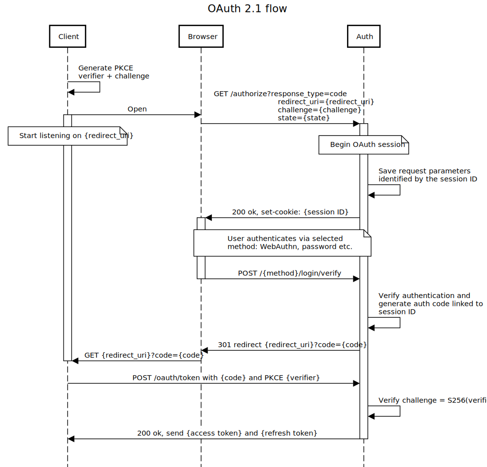
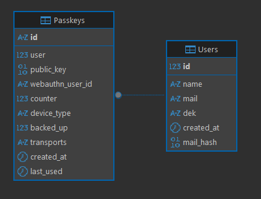

<picture>
  <source
    width="100%"
    srcset="./docs/img/banner-dark-1700x600.avif"
    media="(prefers-color-scheme: dark)"
  />
  <source
    width="100%"
    srcset="./docs/img/banner-light-1700x600.avif"
    media="(prefers-color-scheme: light), (prefers-color-scheme: no-preference)"
  />
  
</picture>


<h1 align="center">OAuth 2.1 with WebAuthn</h1>

<p align="center">
    OAuth 2.1 is the de-facto standard for allowing third-parties to securely access API resources. WebAuthn allows authentication with hardware keys embedded in laptops and phones etc., solving the problem of users using weak or previously used passwords. Putting these together represents the state-of-the-art for authentication and third-party API authorization. This repository contains a complete OAuth 2.1 implementation including a "third-party" client, resource server and authorization server using WebAuthn used for authenticating users. 
</p>

<p align="center">
    
    
    
</p>

<br/>

<picture>
  <source
    width="100%"
    srcset="./docs/img/login-dark-1440p.png"
    media="(prefers-color-scheme: dark)"
  />
  <source
    width="100%"
    srcset="./docs/img/login-light.png"
    media="(prefers-color-scheme: light), (prefers-color-scheme: no-preference)"
  />
  
</picture>

<br/>

> [!WARNING]
> **For testing WebAuthn:** Each WebAuthn registration will be stored on your computer unless manually removed. Having many registrations can slow down the speed of all using WebAuthn to log in. I recommend using <a href="https://developer.chrome.com/docs/devtools/webauthn">emulated authenticators</a> in Chrome DevTools to avoid clogging up your WebAuthn storage.  


<!-- TABLE OF CONTENTS -->
<details>
  <summary>Table of Contents</summary>
  <ol>
    <!-- <li>
      <a href="#about-the-project">About The Project</a>
      <ul>
        <li><a href="#built-with">Built With</a></li>
      </ul>
    </li> -->
    <li>
      <a href="#getting-started">Getting Started</a>
      <ul>
        <!-- <li><a href="#prerequisites">Prerequisites</a></li> -->
        <li><a href="#installation">Installation</a></li>
      </ul>
    </li>
    <li><a href="#oauth">OAuth 2.1 Protocol</a></li>
    <li><a href="#webauthn">WebAuthn</a></li>
    <li><a href="#key-rotation">Automatic Key Rotation</a></li>
    <!-- <li><a href="#acknowledgments">Acknowledgments</a></li> -->
    <li><a href="#roadmap">Roadmap</a></li>
    <li><a href="#references">References</a></li>
  </ol>
</details>


<!-- Structure and Setup -->
<h2 id="getting-started">Getting Started</h2>
The project is set up as a mono-repo with services in the `/src` folder. The server-side services are built as Docker containers and run with Docker Compose, while the client is a simple python program running in the terminal.

<h3 id="installation">Configure Vault</h3>
For the project to work out of the box, vault must be configured with the correct key stores. This can be done automatically with the command: (TODO)

```shell
make x
```

> [!TIP]
> You can reload a single Docker container by running `make service` where service is the name of the server. 
>
> For instance, `make vault` will build and restart the vault container.


<h2 id="oauth">OAuth 2.1 Protocol</h2>
Defined in an active RFC draft[^1], OAuth 2.1 aims to simplify and unifi the many protocols part of the previous OAuth 2.0 standard (various requests for comment, including RFC6749[^2])

<picture>
  <source
    width="100%"
    srcset="./docs/diagrams/oauth-flow-dark.svg"
    media="(prefers-color-scheme: dark)"
  />
  <source
    width="100%"
    srcset="./docs/diagrams/oauth-flow-light.svg"
    media="(prefers-color-scheme: light), (prefers-color-scheme: no-preference)"
  />
  
</picture>


<!-- WebAuthn -->
<h2 id="webauthn">WebAuthn</h2>
*explanation*

> [!TIP]
> Since webauthn login options do not require any input, we can include them in the initial request by using server-side rendering to append them in a `script` tag. 
>
> This reduces the initial page load by a single round-trip, but means we cannot easily cache the site and the initial response should include a `Cache-Control: no-cache` header to prevent storing stale options.


<!-- Key Rotation -->
<h2 id="key-rotation">Automatic Key Rotation</h2>
Each row in the database that contains confidential information has a *data encryption key* (DEK) that is used to encrypt these fields. 
The DEK is encrypted by a *master key* which is managed by the *key management system* (KMS). In this case, [HashiCorp Vault](https://www.hashicorp.com/en/products/vault) is used as the KMS.
Every 30 days the master is replaced by a new unique key, and every DEK is re-wrapped using the new master key. 
This approach scales effectively, as every key-rotation only requires decrypting and encrypting the DEK's instead of the entire database.

<!-- TODO: Image of database schema in DBeaver -->
<picture>
  
</picture>

<h3 id="threat-model">Threat Model</h3>
Assuming a *maximally powerful adversary* with full access to the database (e.g., in the event the database is exfiltrated and analyzed using a future quantum computer), this scheme provides the following security properties:
- **Row-Isolation:** Each row is encrypted using a distinct DEK, ensuring that compromise of a single DEK only exposes that specific row.
- **Post-Compromise Security:** Master keys are rotated periodically. Even if an attacker eventually recovers a historical master key, data added to the database after the rotation remains protected.

> [!IMPORTANT]
> The project uses AES-128 DEKs and AES-256 master keys by default. Breaking these encryptions are considered unfeasible, the data is likely safe even if the database is leaked. 


<!-- Roadmap -->
<h2 id="roadmap">Roadmap</h2>
- [ ] Use docker secrets instead of environment
- [ ] Move everything to microservices in separate repos instead of monorepo


<!-- References -->
<h2 id="references">References</h2>
[^1]: [The OAuth 2.1 Authorization Framework](https://datatracker.ietf.org/doc/html/draft-ietf-oauth-v2-1-13)
[^2]: [RFC6749](https://datatracker.ietf.org/doc/html/rfc6749)