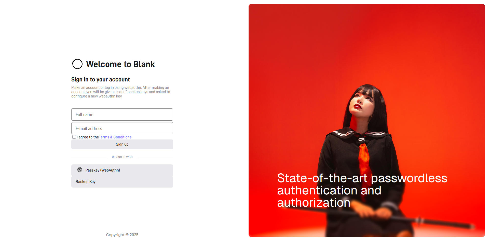

<picture>
  <source
    width="100%"
    srcset="./docs/img/banner-dark-1700x600.avif"
    media="(prefers-color-scheme: dark)"
  />
  <source
    width="100%"
    srcset="./docs/img/banner-light-1700x600.avif"
    media="(prefers-color-scheme: light), (prefers-color-scheme: no-preference)"
  />
  
</picture>


<h1 align="center">OAuth 2.1 with WebAuthn</h1>

<p align="center">
    OAuth 2.1 is the de-facto standard for allowing third-parties to securely access API resources. WebAuthn allows authentication with hardware keys embedded in laptops and phones etc., solving the problem of users using weak or previously used passwords. Putting these together represents the state-of-the-art for authentication and third-party API authorization. This repository contains a complete OAuth 2.1 implementation including a "third-party" client, resource server and authorization server using WebAuthn used for authenticating users. 
</p>

<p align="center">
    
    
    
</p>

<br/>

<picture>
  <source
    width="100%"
    srcset="./docs/img/login-dark-1440p.png"
    media="(prefers-color-scheme: dark)"
  />
  <source
    width="100%"
    srcset="./docs/img/login-light.png"
    media="(prefers-color-scheme: light), (prefers-color-scheme: no-preference)"
  />
  
</picture>

<br/>

> [!WARNING]
> **For testing WebAuthn:** Each WebAuthn registration will be stored on your computer unless manually removed. Having many registrations can slow down the speed of all using WebAuthn to log in. I recommend using <a href="https://developer.chrome.com/docs/devtools/webauthn">emulated authenticators</a> in Chrome DevTools to avoid clogging up your WebAuthn storage.  


## Project Structure
The project is set up as a mono-repo with services in the `/src` folder. The server-side services are built as Docker containers and run with Docker Compose, while the client is a simple python program running in the terminal.


### Configure Vault
For the project to work out of the box, vault must be configured with the correct key stores. This can be done automatically with the command: (TODO) 

```shell
make x
```

> [!TIP]
> You can reload a single Docker container by running `make service` where service is the name of the server. 
>
> For instance, `make vault` will build and restart the vault container.


## OAuth 2.1 Protocol
Defined in <a href="https://datatracker.ietf.org/doc/html/draft-ietf-oauth-v2-1-13">an active RFC draft</a>, OAuth 2.1 aims to simplify and unifi the many protocols part of the previous OAuth 2.0 standard (various requests for comment, including <a href="https://datatracker.ietf.org/doc/html/rfc6749">RFC6749</a>)

<picture>
  <source
    width="100%"
    srcset="./docs/diagrams/oauth-flow-dark.svg"
    media="(prefers-color-scheme: dark)"
  />
  <source
    width="100%"
    srcset="./docs/diagrams/oauth-flow-light.svg"
    media="(prefers-color-scheme: light), (prefers-color-scheme: no-preference)"
  />
  
</picture>

## WebAuthn
*explanation*

> [!TIP]
> Since webauthn login options do not require any input, we can include them in the initial request by using server-side rendering to append them in a `script` tag. 
>
> This reduces the initial page load by a single round-trip, but means we cannot easily cache the site and the initial response should include a `Cache-Control: no-cache` header to prevent storing stale options.

## TODO
- [ ] Clean up authorization server frontend/backend structure
- [ ] Move services into their own repositories and use submodules
- [ ] Use docker secrets instead of environment
- [ ] Enable mTLS between services