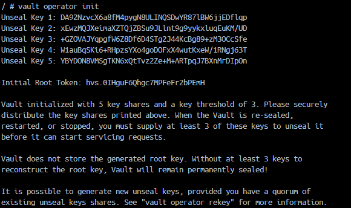

# Vault Server

## Required Configuration

1. Initialize the vault in the containers terminal
```sh
vault operator init
```

<picture>
    
</picture>

2. Note down the unseal keys and root token, and store them somewhere safe

3. Unseal the vault using 3 of the 5 keys generated in step 1
```sh
# Use the UI, or in the CLI:
vault operator unseal
```

4. Log in with root token from step 1

5. Create a new user 

## (Optional) Create a new user
5. Enable an authentication method
    - Go to `Access > Authentication Methods > Enable new method +`
    - Select any from the list and go through the setup process

6. 


## Authenticating services
The services need users as well.